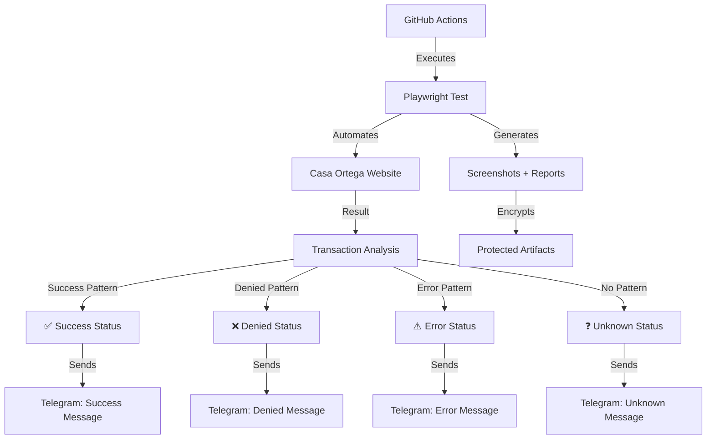

# 🏦 Automated Payments - Casa Ortega

<div align="center">


**Automation system for Casa Ortega deposits with intelligent Telegram notifications**

[🚀 Manual Execution](#-manual-execution) • [⚙️ Configuration](#️-configuration) • [📋 Variables](#-environment-variables) • [🔔 Notifications](#-notifications)

</div>

---

## 📖 Description

This project automates the deposit process for **Casa Ortega** virtual wallet using Playwright and GitHub Actions. The system:

- 🎯 **Automates** the complete deposit process (login → navigation → payment)
- 🤖 **Intelligently detects** transaction results
- 📱 **Notifies** real-time results via Telegram
- 🔒 **Protects** sensitive information with encrypted artifacts
- ⏰ **Executes** automatically respecting business days and holidays
- 🛠️ **Provides** complete debugging with screenshots

## 🏗️ System Architecture



## 🚀 Available Workflows

### 🕐 Daily Automation (`daily.yaml`)
- **Execution**: Automatic at **15:00 Spanish time** (Monday to Friday)
  - 🌞 **Summer (CEST)**: 13:00 UTC (April-October)
  - ❄️ **Winter (CET)**: 14:00 UTC (November-March)
- **Respects**: Holidays defined in `holidays.txt`
- **Function**: Executes scheduled deposits with automatic time adjustment

### 🎮 Manual Execution (`on-demand.yaml`)
- **Execution**: Manual from GitHub Actions
- **Function**: Allows testing and on-demand executions
- **Ignores**: Business day restrictions

## ⚙️ Configuration

### 1️⃣ Clone Repository
```bash
git clone https://github.com/LiReXz/automated-payments.git
cd automated-payments
```

### 2️⃣ Install Dependencies
```bash
npm install
npx playwright install --with-deps
```

### 3️⃣ Configure Environment Variables
Configure the following variables in **GitHub Secrets** (`Settings > Secrets and variables > Actions`):

## 📋 Environment Variables

### 🔐 Casa Ortega Credentials
| Variable | Description | Example |
|----------|-------------|---------|
| `USER_EMAIL` | Email for your Casa Ortega account | `user@email.com` |
| `USER_PASSWORD` | Account password | `MyPassword123!` |

### 💳 Credit/Debit Card Data
| Variable | Description | Format | Example |
|----------|-------------|--------|---------|
| `CARD_NUMBER` | Card number (no spaces) | `1234567890123456` | `4111111111111111` |
| `CARD_EXPIRY` | Expiration date | `MM/YY` | `12/25` |
| `CARD_CVV` | Security code | `123` | `456` |

### 📱 Telegram Configuration
| Variable | Description | How to Obtain |
|----------|-------------|---------------|
| `BOT_TOKEN` | Telegram bot token | 1. Talk to [@BotFather](https://t.me/botfather)<br>2. Execute `/newbot`<br>3. Follow instructions<br>4. Copy the token |
| `CHAT_ID` | Chat ID where to receive notifications | **Method with your own bot:**<br>1. Send any message to your bot<br>2. Go to: `https://api.telegram.org/bot<YOUR_BOT_TOKEN>/getUpdates`<br>3. Look for `"chat":{"id":123456789}`<br>4. That number is your CHAT_ID |

### 🔒 Artifact Security
| Variable | Description | Example |
|----------|-------------|---------|
| `ARTIFACT_PASSWORD` | Password to protect artifacts | `MyPassword456!` |

## 🤖 Detailed Telegram Configuration

### 1️⃣ Create the Bot
1. Talk to [@BotFather](https://t.me/botfather) on Telegram
2. Send `/newbot`
3. Follow instructions to name your bot
4. **Save the token** provided (format: `123456789:ABCdefGHIjklMNOpqrSTUvwxYZ`)

### 2️⃣ Get your CHAT_ID
1. **Send a message** to your newly created bot (any text)
2. **Open your browser** and go to:
   ```
   https://api.telegram.org/bot<YOUR_BOT_TOKEN>/getUpdates
   ```
   > Replace `<YOUR_BOT_TOKEN>` with your bot's actual token
3. **Look in the response** for something like:
   ```json
   "chat": {
     "id": 123456789,
     "first_name": "Your Name",
     "type": "private"
   }
   ```
4. **The `id` number** is your CHAT_ID (example: `123456789`)

### 3️⃣ For Groups (Optional)
If you want notifications in a group:
1. Add your bot to the group
2. Send a message mentioning the bot: `@your_bot_name test`
3. Use the same getUpdates URL
4. The group CHAT_ID will be **negative** (example: `-987654321`)

## 🔔 Notifications

The system sends intelligent notifications to Telegram with different states:

### ✅ Transacción Exitosa
```
🏦 Automated Payments - DAILY

✅ ÉXITO: 🎉 El depósito automático de Casa Ortega se realizó correctamente!

Fecha: 14/10/2025 15:00
Ver detalles: https://github.com/LiReXz/automated-payments/actions/runs/123456
```

### ❌ Transacción Denegada
```
🏦 Automated Payments - MANUAL

❌ TRANSACCIÓN DENEGADA: 💳 La transacción fue denegada por el procesador de pagos.

Fecha: 14/10/2025 15:00
Ver detalles: https://github.com/LiReXz/automated-payments/actions/runs/789012
```

### ⚠️ Error Técnico
```
🏦 Automated Payments - DAILY

❌ ERROR TÉCNICO: ⚠️ Error técnico en la ejecución del workflow. Revisa los logs.

Fecha: 14/10/2025 15:00
Ver detalles: https://github.com/LiReXz/automated-payments/actions/runs/345678
```

## 🚀 Ejecución Manual

1. Ve a la pestaña **Actions** en tu repositorio
2. Selecciona **"On-Demand Execution"**
3. Haz clic en **"Run workflow"**
4. Confirma la ejecución

## 🛠️ Desarrollo Local

### Ejecutar Tests
```bash
# Ejecutar test normal
npm run test:e2e

# Ejecutar con interfaz gráfica
npm run test:headed

# Ejecutar en modo debug
npm run test:debug
```

### Variables de Entorno Local
Crea un archivo `.env` en la raíz del proyecto:
```env
USER_EMAIL=tu-email@dominio.com
USER_PASSWORD=tu-password
CARD_NUMBER=1234567890123456
CARD_EXPIRY=12/25
CARD_CVV=123
```

## 📁 Estructura del Proyecto

```
automated-payments/
├── .github/
│   └── workflows/
│       ├── daily.yaml          # Automatización diaria
│       └── on-demand.yaml      # Ejecución manual
├── scripts/
│   └── deposit-wallet.spec.ts  # Test principal de Playwright
├── holidays.txt                # Días festivos (formato YYYY-MM-DD)
├── package.json                # Dependencias del proyecto
├── playwright.config.ts        # Configuración de Playwright
└── README.md                   # Esta documentación
```

## 📅 Gestión de Festivos

Edita el archivo `holidays.txt` para agregar días festivos:
```
2025-01-01  # Año Nuevo
2025-12-25  # Navidad
2025-07-04  # Día de la Independencia
```

El workflow diario respetará automáticamente estos días.

## ⏰ Dynamic Schedule System

The system automatically adjusts execution time according to official Spanish time:

### 📅 Schedule by Season
| Season | Spanish Time | UTC Time | Months | Cron Expression |
|--------|--------------|----------|--------|-----------------|
| 🌞 **Summer** | 15:00 CEST | 13:00 UTC | April - October | `0 13 * 4-10 *` |
| ❄️ **Winter** | 15:00 CET | 14:00 UTC | November - March | `0 14 * 11-12,1-3 *` |

### 🔄 Automatic Changes
- **Change to summer time**: Last Sunday of March
- **Change to winter time**: Last Sunday of October
- **Automatic adjustment**: The workflow always executes at 15:00 Spanish local time

> **Note**: GitHub Actions cron jobs use monthly approximations. Exact time changes occur on specific dates, but the system maintains consistency during each season.

## 🔍 Debugging y Artifacts

### Artifacts Generados
- 📷 **Screenshots** de cada paso del proceso
- 📹 **Videos** de la ejecución (en caso de fallo)
- 📊 **Reportes HTML** de Playwright
- 📝 **Logs** detallados de la ejecución

### Descargar Artifacts
1. Ve a la ejecución del workflow en **Actions**
2. Busca la sección **"Artifacts"**
3. Descarga `protected-artifacts-YYYYMMDD.zip`
4. Descomprime usando la contraseña configurada en `ARTIFACT_PASSWORD`

## 🔒 Seguridad

### ✅ Medidas Implementadas
- 🔐 **Secrets** de GitHub para información sensible
- 🎭 **Enmascaramiento** de valores en logs
- 🔒 **Artifacts encriptados** con contraseña
- 🚫 **Sin exposición** de tokens en URLs
- 🛡️ **Variables de entorno** protegidas

### ⚠️ Importante
- Nunca commits información sensible al repositorio
- Usa siempre GitHub Secrets para credenciales
- Revisa logs antes de hacer públicos los repositories

## 🤝 Contribuir

1. Fork el proyecto
2. Crea una rama para tu feature (`git checkout -b feature/amazing-feature`)
3. Commit tus cambios (`git commit -m 'Add amazing feature'`)
4. Push a la rama (`git push origin feature/amazing-feature`)
5. Abre un Pull Request

## 📜 Licencia

Este proyecto es para uso personal y educativo. Úsalo de manera responsable.

## 🆘 Soporte

Si tienes problemas:
1. 📋 Revisa los logs en GitHub Actions
2. 📥 Descarga los artifacts para más detalles
3. 🔍 Verifica que todas las variables estén configuradas
4. 📱 Confirma que el bot de Telegram funcione

---

<div align="center">

[⬆️ Back to top](#-automated-payments---casa-ortega)

</div>