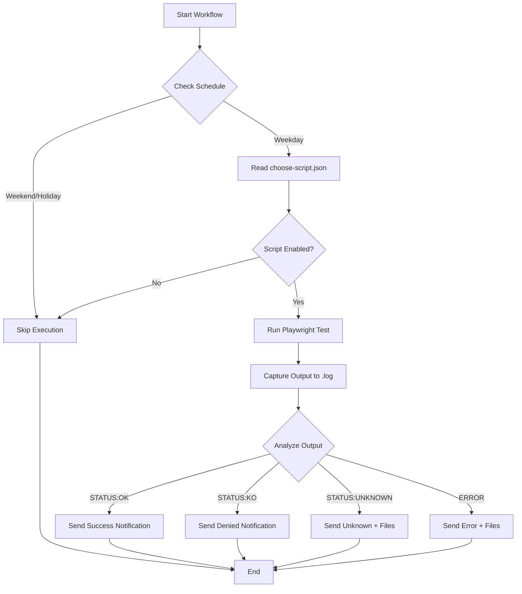

# 🏦 Automated Payments

<div align="center">


**Multi-service automation system with intelligent result detection and Telegram notifications**


</div>


---


## 📖 Description


Automated deposit system for multiple services using Playwright and GitHub Actions. Automatically detects transaction results (success/denied/unknown) and sends detailed Telegram notifications.


### 🎯 Supported Services

- **🏦 Casa Ortega** - Virtual wallet deposits

- **🌱 Huerta a Casa** - Virtual wallet deposits


Flexible configuration via `choose-script.json` to enable/disable services individually.

---

## ⚙️ Script Configuration

Scripts are configured via `choose-script.json`:

```json
{
  "scripts": {
    "casaortega": {
      "enabled": false,
      "path": "scripts/casaortega.spec.ts",
      "name": "CASA ORTEGA"
    },
    "huertaacasa": {
      "enabled": true,
      "path": "scripts/huertaacasa.spec.ts",
      "name": "HUERTA A CASA"
    }
  }
```

**To enable/disable a script**: Change `"enabled"` to `true` or `false`

---

## 🚀 Workflows

### 🕐 Daily Automation (`daily.yaml`)
- **Execution**: Automatic **Monday to Friday** at **15:00** (Spanish time)
- **Respects**: Holidays defined in `holidays.txt`
- **Smart scheduling**: 
  - Summer (April-October): 13:00 UTC
  - Winter (November-March): 14:00 UTC
- **Runs**: Only enabled scripts in `choose-script.json`
- **Notifications**: Individual Telegram message per executed service

### 🎮 Manual Execution (On-Demand)

Two separate manual workflows for independent execution:

#### 🏦 Casa Ortega On-Demand (`casaortega-on-demand.yaml`)
- **Execution**: Manual from GitHub Actions
- **Purpose**: Execute only Casa Ortega when needed
- **Usage**: Testing and one-time deposits

#### 🌱 Huerta a Casa On-Demand (`huertaacasa-on-demand.yaml`)
- **Execution**: Manual from GitHub Actions
- **Purpose**: Execute only Huerta a Casa when needed
- **Usage**: Testing and one-time deposits

---

## 📋 Environment Variables (GitHub Secrets)

Configure the following variables in **GitHub Secrets** (`Settings > Secrets and variables > Actions`):

### 🔐 Account Credentials
- `USER_EMAIL` - Account email
- `USER_PASSWORD` - Account password

### 💳 Card Data
- `CARD_NUMBER` - Card number (no spaces)
- `CARD_EXPIRY` - Expiration date (format: `MM / YY` with spaces)
- `CARD_CVV` - CVV security code

### 📱 Telegram Configuration
- `BOT_TOKEN` - Get from [@BotFather](https://t.me/botfather)
- `CHAT_ID` - Your chat ID (send message to bot, then visit `https://api.telegram.org/bot<TOKEN>/getUpdates`)

---

## 🔔 Notifications

The system sends individual Telegram notifications for each executed service:

### ✅ Transaction Accepted (STATUS:OK)
```
🏦 CASA ORTEGA - DAILY

✅ TRANSACCIÓN ACEPTADA
¡Felicidades! El depósito se realizó correctamente.

📅 21/11/2025 15:00:00
🔗 Ver detalles
```
**No files attached** - Normal operation

### ❌ Transaction Denied (STATUS:KO)
```
🌱 HUERTA A CASA - ON DEMAND

❌ TRANSACCIÓN DENEGADA
Por favor, revisa si hay saldo disponible para hoy.

📅 21/11/2025 15:00:00
🔗 Ver detalles
```
**No files attached** - Payment processor rejection (not a technical error)

### ❓ Unknown Status (STATUS:UNKNOWN)
```
🏦 CASA ORTEGA - DAILY

❓ ESTADO DESCONOCIDO
No se ha podido identificar el resultado. Revisa los archivos adjuntos.

📅 21/11/2025 15:00:00
🔗 Ver detalles
```
**With files attached** - Includes screenshot + video for diagnosis

### 💥 Technical Error (ERROR)
```
🌱 HUERTA A CASA - ON DEMAND

💥 ERROR TÉCNICO
Ocurrió un error durante la ejecución. Revisa los logs.

📅 21/11/2025 15:00:00
🔗 Ver detalles
```
**With files attached** - For technical troubleshooting

---

## 🔍 Detection System

Scripts use intelligent detection with **strict `getByRole` selectors**:

```typescript
const successLocator = page.getByRole('heading', { name: /OPERACIÓN AUTORIZADA/i });
const deniedLocator = page.getByRole('heading', { name: /Transacción denegada/i });
```

**Status codes**:
- `STATUS:OK` - Transaction approved
- `STATUS:KO` - Transaction denied
- `STATUS:UNKNOWN` - Unable to determine result

Scripts **never fail** - they always log status for workflow analysis.

---

## 📁 File Delivery

**Files are only sent for technical errors or unknown status** - not for successful or denied transactions.

- **Automatic ZIP compression** of screenshots, reports, and logs
- **Direct delivery** via Telegram (no GitHub artifacts)
- **Specific artifacts**:
  - `casaortega-unknown-state.png` + `.webm` for Casa Ortega
  - `huertaacasa-unknown-state.png` + `.webm` for Huerta a Casa

---

## 🔒 Security

- **GitHub Secrets** for all sensitive information with automatic masking
- **Value masking** in logs to prevent credential exposure
- **No token exposure** in URLs or logs
- **Selective file delivery** only for technical debugging
- All sensitive data automatically filtered in GitHub Actions logs

---

## 📁 Project Structure

```
automated-payments/
├── .github/workflows/
│   ├── daily.yaml                  # Daily automation
│   ├── casaortega-on-demand.yaml   # Casa Ortega manual execution
│   └── huertaacasa-on-demand.yaml  # Huerta a Casa manual execution
├── scripts/
│   ├── casaortega.spec.ts          # Casa Ortega automation
│   └── huertaacasa.spec.ts         # Huerta a Casa automation
├── choose-script.json              # Script configuration
├── holidays.txt                    # Holiday management (DD/MM format)
├── playwright.config.ts            # Playwright settings
└── package.json
```

---

## 🛠️ Quick Setup

1. **Clone**: `git clone https://github.com/LiReXz/automated-payments.git`
2. **Install**: `npm install`
3. **Configure Secrets**: Add all environment variables to GitHub Secrets
4. **Enable Scripts**: Edit `choose-script.json` to select which scripts to run
5. **Add Holidays**: Update `holidays.txt` with your region's holidays (DD/MM format)
6. **Test**: Use manual execution workflows for testing
7. **Deploy**: Daily workflow runs automatically

---

## 🧪 Local Testing

```bash
# Set environment variables
$env:USER_EMAIL="your-email@example.com"
$env:USER_PASSWORD="your-password"
$env:CARD_NUMBER="1234567890123456"
$env:CARD_CVV="123"
$env:CARD_EXPIRY="12 / 25"

# Run specific test
npx playwright test scripts/huertaacasa.spec.ts

# Run in headed mode (see browser)
npx playwright test scripts/casaortega.spec.ts --headed
```

---

## 🔧 Technical Details

### Timeouts
- **Test timeout**: 180 seconds (3 minutes)
- **Transaction wait**: 30 seconds after payment button click
- **Job timeout**: 20 minutes per workflow

### Browser Configuration
- **Engine**: Chromium (Playwright)
- **Mode**: Headless
- **Viewport**: 1280x720
- **Video**: Always recorded (`video: 'on'`)
- **Screenshots**: Only for unknown states

### Workflow Analysis
Workflows capture script output to `.log` files and use `grep` to detect status:
```bash
grep -q "STATUS:OK" script_output.log    # Success
grep -q "STATUS:KO" script_output.log    # Denied
grep -q "STATUS:UNKNOWN" script_output.log  # Unknown
```

---

## 📊 Workflow Logic



---

## 🤝 Contributing

This is a personal automation project, but suggestions are welcome:
1. Fork the repository
2. Create a feature branch
3. Make your changes
4. Submit a pull request

---

## 📝 License

This project is for **personal and educational use only**. Use responsibly and ensure compliance with the terms of service of the platforms you automate.

---

## ⚠️ Disclaimer

**Important**: This automation tool is provided as-is for educational purposes. Users are responsible for:
- Complying with terms of service of automated platforms
- Ensuring legal use in their jurisdiction
- Maintaining security of credentials and tokens
- Any consequences of automated transactions

**Use at your own risk.**

---

<div align="center">

**⚠️ For personal and educational use only. Use responsibly.**

</div>
