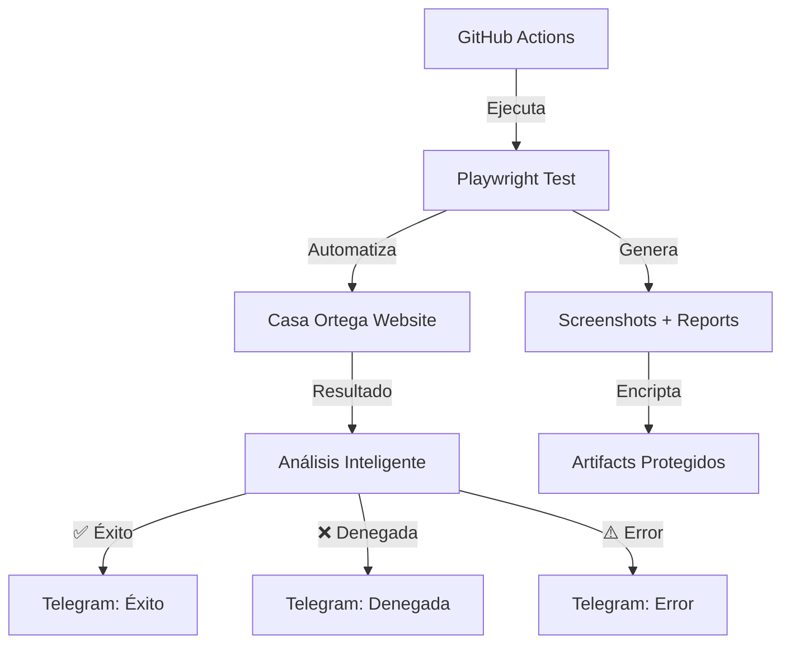

# 🏦 Automated Payments - Casa Ortega

<div align="center">


**Sistema de automatización para depósitos en Casa Ortega con notificaciones inteligentes vía Telegram**

[🚀 Ejecutar Manual](#-ejecución-manual) • [⚙️ Configuración](#️-configuración) • [📋 Variables](#-variables-de-entorno) • [🔔 Notificaciones](#-notificaciones)

</div>

---

## 📖 Descripción

Este proyecto automatiza el proceso de depósito de fondos en el monedero virtual de **Casa Ortega** utilizando Playwright y GitHub Actions. El sistema:

- 🎯 **Automatiza** el proceso completo de depósito (login → navegación → pago)
- 🤖 **Detecta inteligentemente** el resultado de las transacciones
- 📱 **Notifica** resultados en tiempo real vía Telegram
- 🔒 **Protege** información sensible con artifacts encriptados
- ⏰ **Ejecuta** automáticamente respetando días laborales y festivos
- 🛠️ **Proporciona** debugging completo con capturas de pantalla

## 🏗️ Arquitectura del Sistema



## 🚀 Workflows Disponibles

### 🕐 Daily Automation (`daily.yaml`)
- **Ejecución**: Automática a las **15:00 hora española** (lunes a viernes)
  - 🌞 **Verano (CEST)**: 13:00 UTC (abril-octubre)
  - ❄️ **Invierno (CET)**: 14:00 UTC (noviembre-marzo)
- **Respeta**: Festivos definidos en `holidays.txt`
- **Función**: Ejecuta depósitos de forma programada con ajuste automático de horario

### 🎮 Manual Execution (`on-demand.yaml`)
- **Ejecución**: Manual desde GitHub Actions
- **Función**: Permite pruebas y ejecuciones bajo demanda
- **Ignora**: Restricciones de días laborales

## ⚙️ Configuración

### 1️⃣ Clonar el Repositorio
```bash
git clone https://github.com/LiReXz/automated-payments.git
cd automated-payments
```

### 2️⃣ Instalar Dependencias
```bash
npm install
npx playwright install --with-deps
```

### 3️⃣ Configurar Variables de Entorno
Configura las siguientes variables en **GitHub Secrets** (`Settings > Secrets and variables > Actions`):

## 📋 Variables de Entorno

### 🔐 Credenciales de Casa Ortega
| Variable | Descripción | Ejemplo |
|----------|-------------|---------|
| `USER_EMAIL` | Email de tu cuenta de Casa Ortega | `usuario@email.com` |
| `USER_PASSWORD` | Contraseña de tu cuenta | `MiPassword123!` |

### 💳 Datos de Tarjeta de Crédito/Débito
| Variable | Descripción | Formato | Ejemplo |
|----------|-------------|---------|---------|
| `CARD_NUMBER` | Número de tarjeta (sin espacios) | `1234567890123456` | `4111111111111111` |
| `CARD_EXPIRY` | Fecha de vencimiento | `MM/YY` | `12/25` |
| `CARD_CVV` | Código de seguridad | `123` | `456` |

### 📱 Configuración de Telegram
| Variable | Descripción | Cómo Obtener |
|----------|-------------|--------------|
| `BOT_TOKEN` | Token del bot de Telegram | 1. Habla con [@BotFather](https://t.me/botfather)<br>2. Ejecuta `/newbot`<br>3. Sigue las instrucciones<br>4. Copia el token |
| `CHAT_ID` | ID del chat donde recibir notificaciones | **Método con tu propio bot:**<br>1. Escribe cualquier mensaje a tu bot<br>2. Ve a: `https://api.telegram.org/bot<TU_BOT_TOKEN>/getUpdates`<br>3. Busca `"chat":{"id":123456789}`<br>4. Ese número es tu CHAT_ID |

### 🔒 Seguridad de Artifacts
| Variable | Descripción | Ejemplo |
|----------|-------------|---------|
| `ARTIFACT_PASSWORD` | Contraseña para proteger artifacts | `MiPassword456!` |

## 🤖 Configuración Detallada de Telegram

### 1️⃣ Crear el Bot
1. Habla con [@BotFather](https://t.me/botfather) en Telegram
2. Envía `/newbot`
3. Sigue las instrucciones para nombrar tu bot
4. **Guarda el token** que te proporciona (formato: `123456789:ABCdefGHIjklMNOpqrSTUvwxYZ`)

### 2️⃣ Obtener tu CHAT_ID
1. **Envía un mensaje** a tu bot recién creado (cualquier texto)
2. **Abre tu navegador** y ve a:
   ```
   https://api.telegram.org/bot<TU_BOT_TOKEN>/getUpdates
   ```
   > Reemplaza `<TU_BOT_TOKEN>` con el token real de tu bot
3. **Busca en la respuesta** algo como:
   ```json
   "chat": {
     "id": 123456789,
     "first_name": "Tu Nombre",
     "type": "private"
   }
   ```
4. **El número del `id`** es tu CHAT_ID (ejemplo: `123456789`)

### 3️⃣ Para Grupos (Opcional)
Si quieres notificaciones en un grupo:
1. Agrega tu bot al grupo
2. Envía un mensaje mencionando al bot: `@tu_bot_name test`
3. Usa la misma URL de getUpdates
4. El CHAT_ID del grupo será **negativo** (ejemplo: `-987654321`)

## 🔔 Notificaciones

El sistema envía notificaciones inteligentes a Telegram con diferentes estados:

### ✅ Transacción Exitosa
```
🏦 Automated Payments - DAILY

✅ ÉXITO: 🎉 El depósito automático de Casa Ortega se realizó correctamente!

Fecha: 14/10/2025 15:00
Ver detalles: https://github.com/LiReXz/automated-payments/actions/runs/123456
```

### ❌ Transacción Denegada
```
🏦 Automated Payments - MANUAL

❌ TRANSACCIÓN DENEGADA: 💳 La transacción fue denegada por el procesador de pagos.

Fecha: 14/10/2025 15:00
Ver detalles: https://github.com/LiReXz/automated-payments/actions/runs/789012
```

### ⚠️ Error Técnico
```
🏦 Automated Payments - DAILY

❌ ERROR TÉCNICO: ⚠️ Error técnico en la ejecución del workflow. Revisa los logs.

Fecha: 14/10/2025 15:00
Ver detalles: https://github.com/LiReXz/automated-payments/actions/runs/345678
```

## 🚀 Ejecución Manual

1. Ve a la pestaña **Actions** en tu repositorio
2. Selecciona **"On-Demand Execution"**
3. Haz clic en **"Run workflow"**
4. Confirma la ejecución

## 🛠️ Desarrollo Local

### Ejecutar Tests
```bash
# Ejecutar test normal
npm run test:e2e

# Ejecutar con interfaz gráfica
npm run test:headed

# Ejecutar en modo debug
npm run test:debug
```

### Variables de Entorno Local
Crea un archivo `.env` en la raíz del proyecto:
```env
USER_EMAIL=tu-email@dominio.com
USER_PASSWORD=tu-password
CARD_NUMBER=1234567890123456
CARD_EXPIRY=12/25
CARD_CVV=123
```

## 📁 Estructura del Proyecto

```
automated-payments/
├── .github/
│   └── workflows/
│       ├── daily.yaml          # Automatización diaria
│       └── on-demand.yaml      # Ejecución manual
├── scripts/
│   └── deposit-wallet.spec.ts  # Test principal de Playwright
├── holidays.txt                # Días festivos (formato YYYY-MM-DD)
├── package.json                # Dependencias del proyecto
├── playwright.config.ts        # Configuración de Playwright
└── README.md                   # Esta documentación
```

## 📅 Gestión de Festivos

Edita el archivo `holidays.txt` para agregar días festivos:
```
2025-01-01  # Año Nuevo
2025-12-25  # Navidad
2025-07-04  # Día de la Independencia
```

El workflow diario respetará automáticamente estos días.

## ⏰ Sistema de Horarios Dinámico

El sistema ajusta automáticamente la hora de ejecución según el horario oficial español:

### 📅 Horarios por Temporada
| Temporada | Horario España | Horario UTC | Meses | Cron Expression |
|-----------|----------------|-------------|--------|-----------------|
| 🌞 **Verano** | 15:00 CEST | 13:00 UTC | Abril - Octubre | `0 13 * 4-10 *` |
| ❄️ **Invierno** | 15:00 CET | 14:00 UTC | Noviembre - Marzo | `0 14 * 11-12,1-3 *` |

### 🔄 Cambios Automáticos
- **Cambio a horario de verano**: Último domingo de marzo
- **Cambio a horario de invierno**: Último domingo de octubre
- **Ajuste automático**: El workflow se ejecuta siempre a las 15:00 hora local española

> **Nota**: Los cron jobs de GitHub Actions usan aproximaciones mensuales. Los cambios exactos de horario ocurren en fechas específicas, pero el sistema mantiene consistencia durante cada temporada.

## 🔍 Debugging y Artifacts

### Artifacts Generados
- 📷 **Screenshots** de cada paso del proceso
- 📹 **Videos** de la ejecución (en caso de fallo)
- 📊 **Reportes HTML** de Playwright
- 📝 **Logs** detallados de la ejecución

### Descargar Artifacts
1. Ve a la ejecución del workflow en **Actions**
2. Busca la sección **"Artifacts"**
3. Descarga `protected-artifacts-YYYYMMDD.zip`
4. Descomprime usando la contraseña configurada en `ARTIFACT_PASSWORD`

## 🔒 Seguridad

### ✅ Medidas Implementadas
- 🔐 **Secrets** de GitHub para información sensible
- 🎭 **Enmascaramiento** de valores en logs
- 🔒 **Artifacts encriptados** con contraseña
- 🚫 **Sin exposición** de tokens en URLs
- 🛡️ **Variables de entorno** protegidas

### ⚠️ Importante
- Nunca commits información sensible al repositorio
- Usa siempre GitHub Secrets para credenciales
- Revisa logs antes de hacer públicos los repositories

## 🤝 Contribuir

1. Fork el proyecto
2. Crea una rama para tu feature (`git checkout -b feature/amazing-feature`)
3. Commit tus cambios (`git commit -m 'Add amazing feature'`)
4. Push a la rama (`git push origin feature/amazing-feature`)
5. Abre un Pull Request

## 📜 Licencia

Este proyecto es para uso personal y educativo. Úsalo de manera responsable.

## 🆘 Soporte

Si tienes problemas:
1. 📋 Revisa los logs en GitHub Actions
2. 📥 Descarga los artifacts para más detalles
3. 🔍 Verifica que todas las variables estén configuradas
4. 📱 Confirma que el bot de Telegram funcione

---

<div align="center">

**Hecho con ❤️ para automatizar pagos de forma segura**

[⬆️ Volver arriba](#-automated-payments---casa-ortega)

</div>